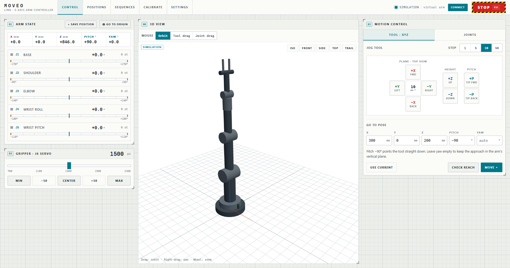
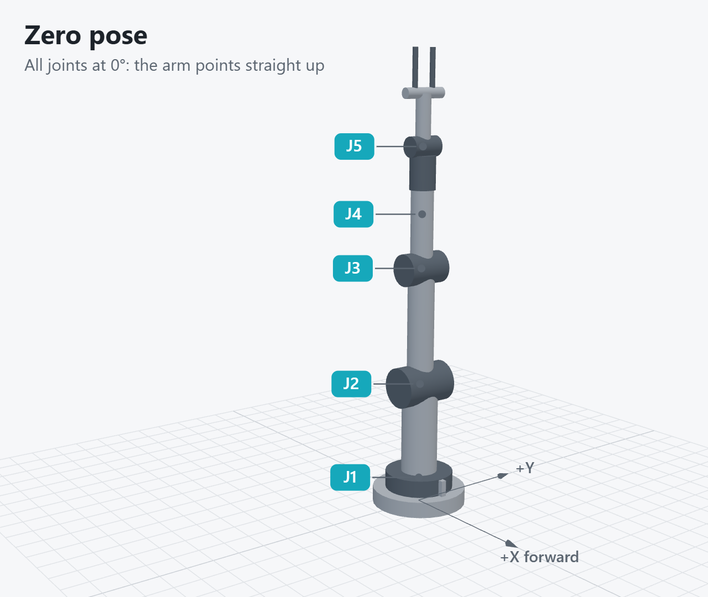
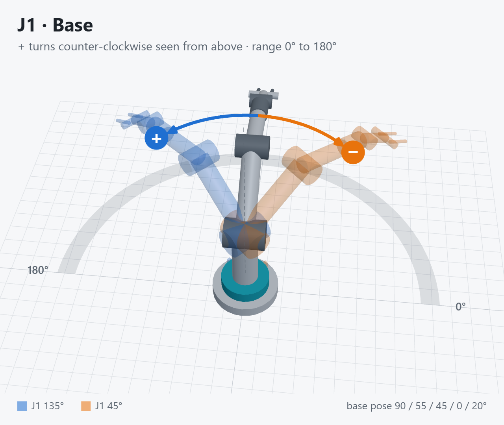
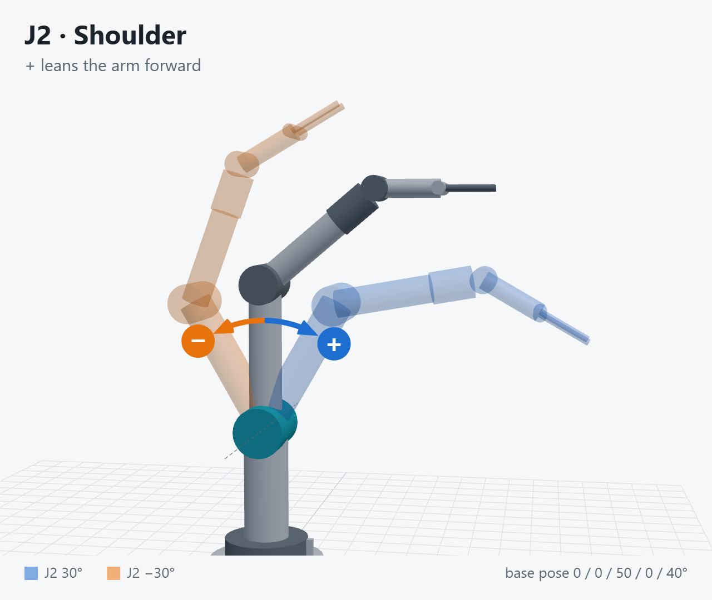
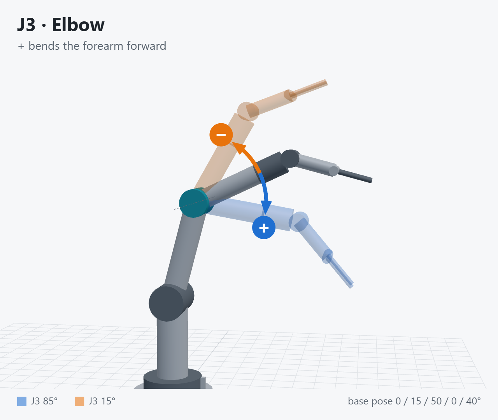
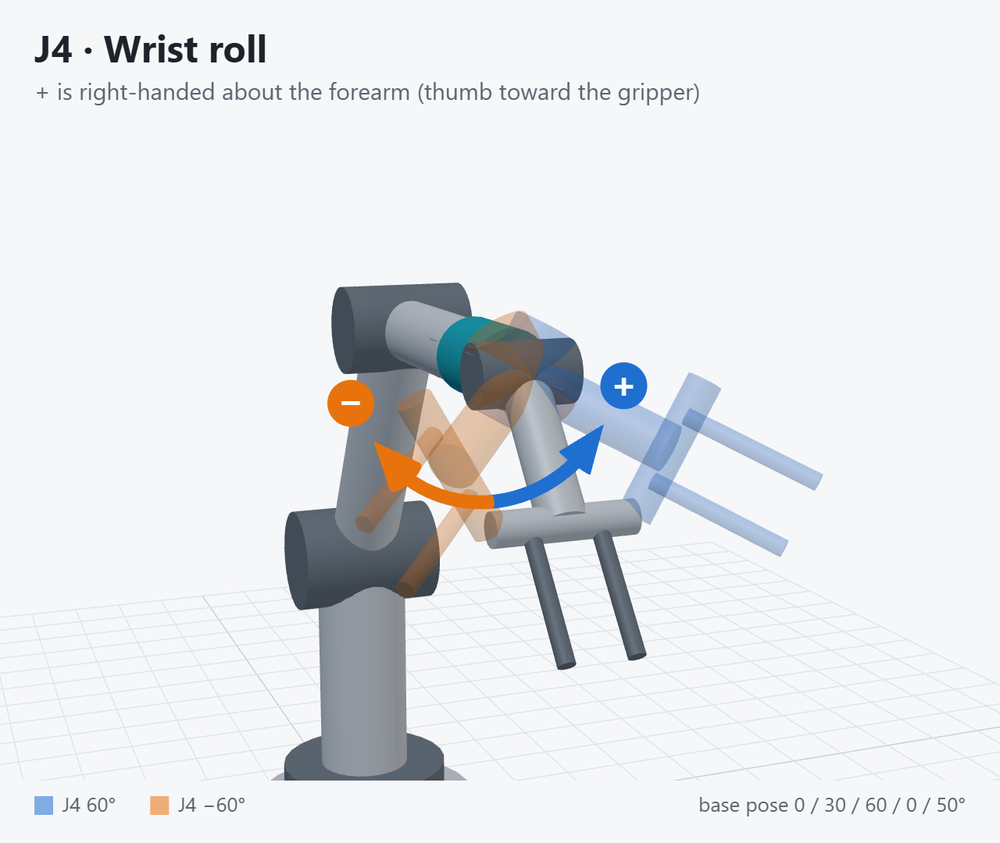
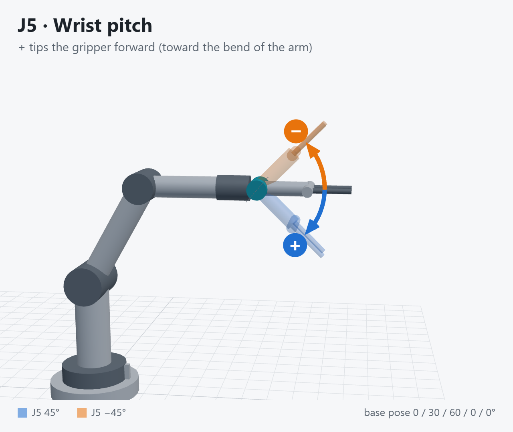

# Moveo Link

Desktop controller for the [Moveo](https://github.com/rookidroid/moveo) 5-axis robot arm over WiFi.
It talks to the ESP32 firmware's REST API (`FIRMWARE/moveo_arduino`) and adds positions, sequences and a
3D view with mouse teleoperation.



## Features

**Everything the firmware's web page does:**
- Arm state: tool pose, joint angles and steps, and soft-limit meters.
- Go to origin and the E-stop (STOP button or <kbd>Esc</kbd>).
- Tool (XYZ) jogging and go-to-pose with a reach check, through the firmware IK.
- Joint jogging and targets in degrees or steps.
- Motion settings (speed / acceleration).
- Gripper servo.
- The 4-step joint calibration wizard.

**Simulation first:** the app starts in simulation mode and never contacts the robot until you press
**Connect** (app bar or Settings). Every feature, including the 3D view, positions and sequences, then drives
a built-in virtual arm, so motions can be prepared and rehearsed offline. Disconnecting stops the arm and goes
back to the simulation. If the robot stops answering while connected, the app shows **Offline** and stays on
the robot (it never silently switches to the simulation).

**New:**
- **3D view.** A live model of the arm and a translucent *ghost* for previews.
  - Trail of the tool path.
  - Camera presets (Iso, Front, Side, Top).
- **Mouse teleoperation** in the 3D view:
  - *Tool drag*: drag the gizmo on the fingertip. IK solves the arm live, and the ghost turns red when the pose is out of reach. Shift + wheel changes the pitch.
  - *Joint drag*: click a link to pick its joint, then drag the ring around the joint axis. Blue **+** and orange **−** arrows on the ring show which way the joint's angle grows, as in [Joint directions](#joint-directions).
  - *Preview* mode moves the arm on **Move** or <kbd>Enter</kbd>. *Live* mode follows the drag, throttled to one request at a time at a capped speed.
- **Positions:**
  - Teach the current arm position, or create tool poses by hand.
  - Edit, convert between joints and tool pose, preview as a ghost, and go there at a chosen speed.
- **Sequences:** chain *move* steps (position, speed %, dwell), *gripper* steps and *wait* steps.
  - Reorder steps by dragging, and set a repeat count.
  - Validate the sequence and preview its tool path in 3D.
  - Run, pause/resume, single-step, run from a step, and stop.
  - Each move waits until all joints have stopped before the next step starts.
- Import/export of the library as JSON.

## Requirements

- The robot firmware with the `POST /movejoints` endpoint and the `speed` option on `/movepose` (current
  `moveo_arduino`). Older firmware still works for everything except joint-space positions and sequence speeds.
- To connect, join the arm's WiFi access point **moveo** (password `moveo_1234`), press **Connect** and
  confirm the address (default `192.168.4.1`, remembered between sessions).

## Joint directions

Angles are in degrees and match the firmware's arm model (`moveo_config.h`). With every joint at 0° the arm
points straight up. Each diagram below shows a base pose (solid) and the same pose with one joint turned
**+** (blue) and **−** (orange). Calibrate each joint so that its + direction matches. J1 only turns through
0° to 180°, so its diagram starts at 90°.

<table>
  <tr>
    <td></td>
    <td></td>
  </tr>
  <tr>
    <td></td>
    <td></td>
  </tr>
  <tr>
    <td></td>
    <td></td>
  </tr>
</table>

| Joint | + direction |
|---|---|
| J1 base | Counter-clockwise seen from above. Range 0° to 180° (0° = arm faces +X) |
| J2 shoulder | Leans the arm forward (toward +X at J1 = 0) |
| J3 elbow | Bends the forearm forward |
| J4 wrist roll | Right-handed about the forearm (thumb toward the gripper) |
| J5 wrist pitch | Tips the gripper forward, toward the bend of the arm |

## Development

```bash
npm install
npm run dev           # Electron app with hot reload (starts in simulation)
npm run mock          # stand-alone simulated robot over HTTP on localhost:8080 (-- --uncalibrated
                      # to test calibration); connect the app to localhost:8080 to test the real path
npm run web           # renderer only, in a browser at localhost:5180; Connect goes to the mock via a proxy
npm test              # unit tests (kinematics, simulator, sequence runner, storage)
npm run typecheck
npm run diagrams      # redraw the joint direction diagrams in docs/joints/ from the 3D model
npm run dist          # Windows installer + portable exe in dist/
```

The positions and sequences library is stored in `%APPDATA%\Moveo Link\library.json`.

### Layout

| Path | |
|---|---|
| `src/main/` | Electron main process: robot HTTP client (`robot.ts`), JSON storage (`store.ts`) |
| `src/preload/` | `window.moveo` bridge (IPC) |
| `src/shared/kinematics.ts` | Port of the firmware's `kinematics.cpp`. Keep `KIN` in sync with `moveo_config.h` |
| `src/renderer/lib/` | API/polling core, 3D view (`arm3d.ts`), sequence runner, library |
| `src/renderer/views/` | Control, Positions, Sequences, Calibrate, Settings |
| `src/shared/simRobot.ts` | Simulated robot (same REST API as the firmware), used by simulation mode and the mock |
| `scripts/mock-robot.ts` | HTTP wrapper around the simulated robot |
| `scripts/joint-diagrams/` | Draws `docs/joints/*.png` with the 3D view's arm model (`src/renderer/lib/armModel.ts`) |

All robot requests go through the main process because the firmware's POST replies carry no CORS headers.
